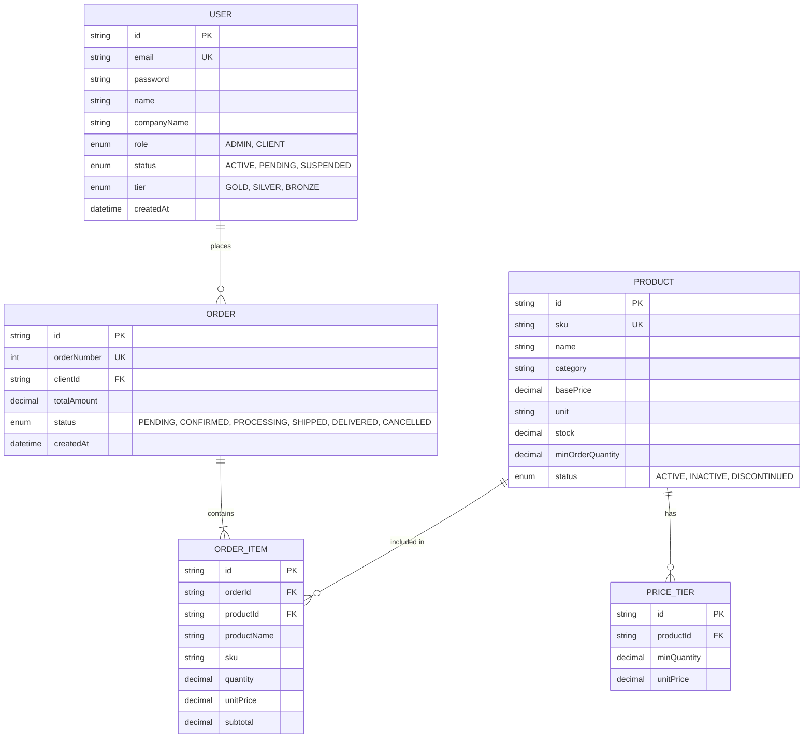

# La Cañada Seafood B2B Portal: Database Specification

**Subject:** Database Schema & Data Logic  
**ORM:** Prisma (v7.8.0)  
**Database Engine:** PostgreSQL  
**Language:** English  

---

## 1. Overview
The La Cañada Seafood B2B database is designed to handle high-volume wholesale transactions, complex pricing structures, and real-time inventory tracking. It utilizes a relational model (PostgreSQL) managed through **Prisma ORM** to ensure data integrity and type safety across the application.

## 2. Entity Relationship Diagram (ERD)

## 3. Data Logic & Business Rules

### 3.1. User & Client Tiers
The `User` table stores both administrators and clients.
- **Tiers**: Clients are assigned a `UserTier` (Bronze, Silver, Gold).
- **Impact**: The tier is used by the frontend and services to apply volume-based discounts.
- **Status Control**: A user must have `status: ACTIVE` to place orders. The `PENDING` status is used for manual verification of new B2B accounts.

### 3.2. Product Pricing Logic
- **Base Price**: The standard wholesale price per unit (kg, dozen, etc.).
- **Price Tiers**: A separate `PriceTier` table allows for "Volume Discounts". 
    - *Example*: 1-10kg = $10/kg; 11-50kg = $8/kg.
- **Minimum Order Quantity (MOQ)**: Enforced at the database level to ensure transactions meet wholesale thresholds.

### 3.3. Order Immutability
To ensure historical accuracy, the `OrderItem` table stores **snapshots** of product data:
- `productName` and `sku` are saved directly in the order item.
- If a product's name or price changes in the `Product` table later, the historical order remains unchanged.
- `subtotal` is calculated as `quantity * unitPrice` and stored to avoid floating-point errors in future reports.

### 3.4. Inventory Resilience
- **Decimal Precision**: All weight and currency fields use `Decimal(10, 2)` to avoid IEEE 754 rounding issues common in wholesale trade.
- **Cascade Deletes**: Deleting a Product will cascade and delete its `PriceTiers`, but it will **not** delete historical `OrderItems` (enforced via foreign key constraints).

## 4. Table Definitions

### `users`
| Field | Type | Description |
| :--- | :--- | :--- |
| `id` | CUID | Primary Key |
| `email` | String | Unique login identifier |
| `role` | Enum | ADMIN or CLIENT |
| `tier` | Enum | Determines discount level |

### `products`
| Field | Type | Description |
| :--- | :--- | :--- |
| `sku` | String | Unique Stock Keeping Unit |
| `basePrice` | Decimal | Default wholesale price |
| `stock` | Decimal | Current physical inventory |

### `orders`
| Field | Type | Description |
| :--- | :--- | :--- |
| `orderNumber` | Int | Auto-incrementing human-readable ID |
| `status` | Enum | Workflow tracker (Pending -> Delivered) |
| `totalAmount` | Decimal | Final order sum including taxes/shipping |

---
*End of Specification*
